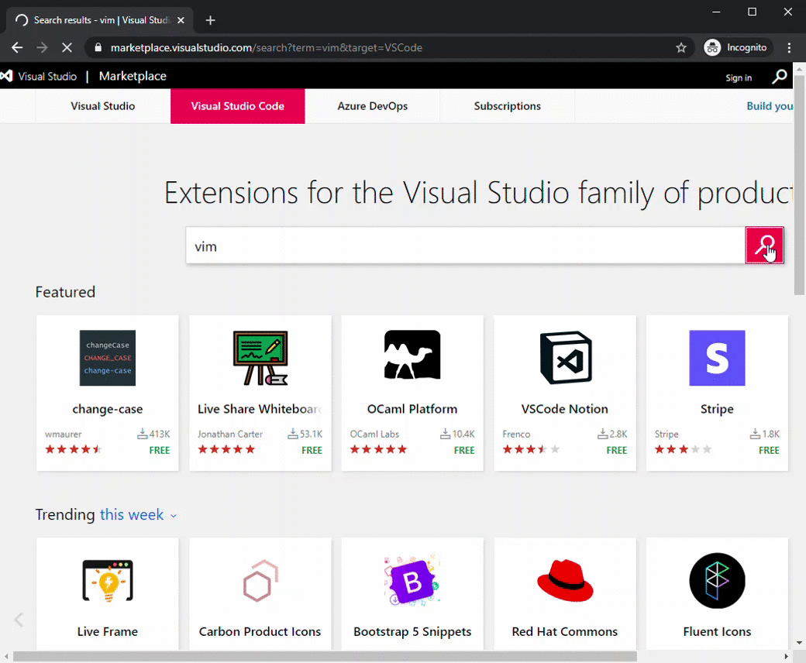
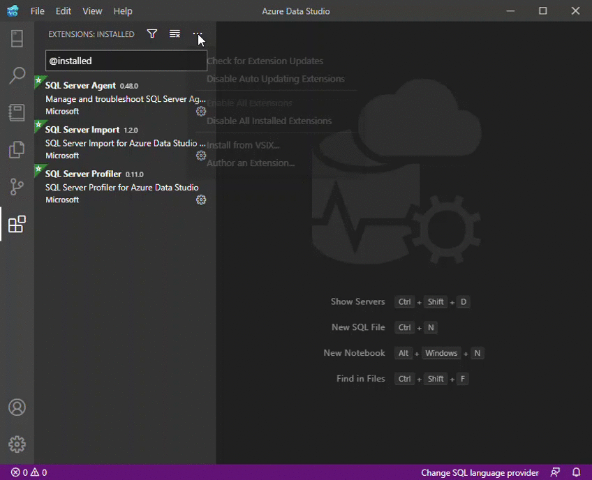

I had read somewhere that you can install Visual Studio Code extensions from the `.vsix` file on Azure Data Studio but I didn't find any clear instructions on how to do it.  I have demonstrated how to do it using to GIF files of me installing an extension that I love, vim.

- Download the `.vsix` file from the extension's page on Visual Studio Marketplace

- Install from VSIX extension file

