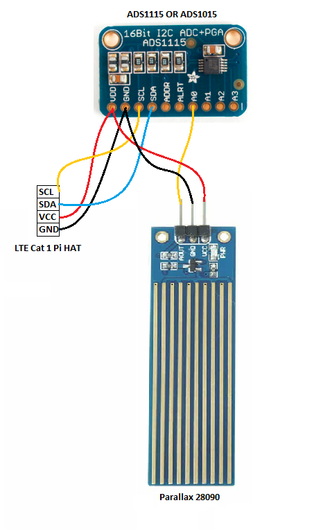
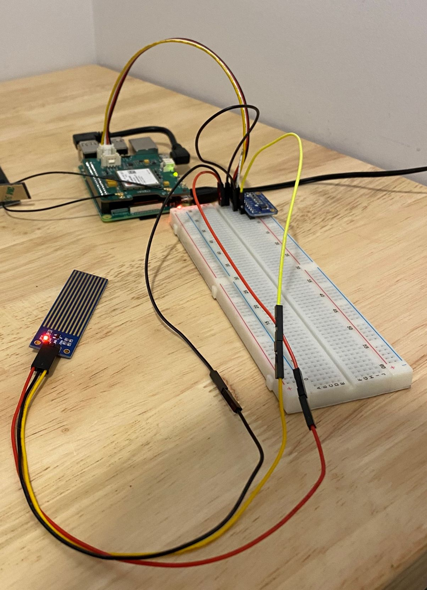
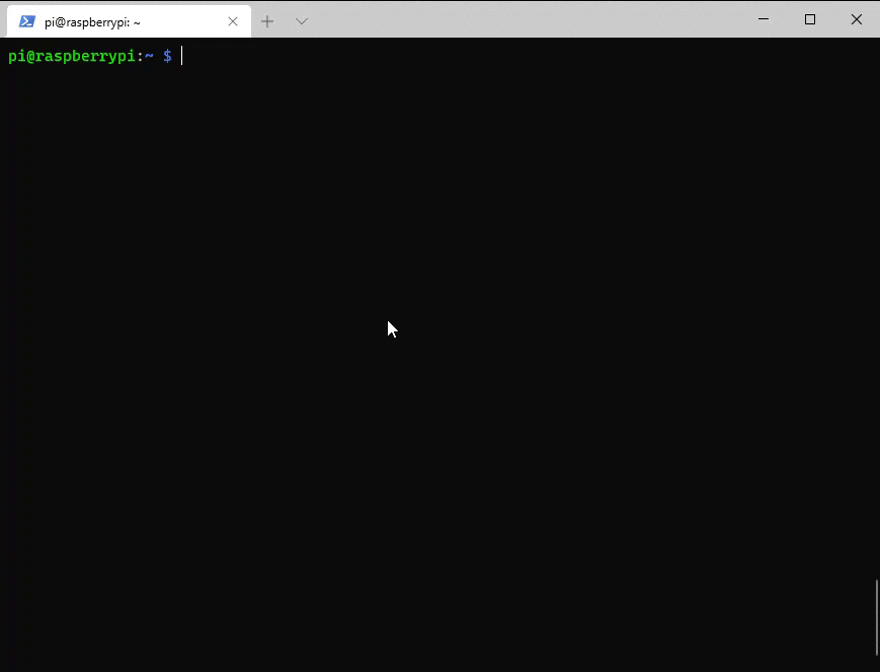

# IoT Home Environmental Alerting
Internet of Things (IoT) is an ever expanding field and one of the most common things to do is environmental alerting.  To do that, this tutorial uses the [Twilio Developer Kit for Broadband IoT](https://www.twilio.com/docs/iot/wireless/get-started-twilio-developer-kit-broadband-iot) to monitor for temperature, humidity, and liquid and sends an SMS alerting you to conditions that are outside your desired parameters. The developer kit allows you to be connected to the cellular network, allowing for monitoring at remote locations such as a cabin where internet access may not be readily available.  

If you are setting this up in a location where internet is available, data via a cellular network is not needed to complete setup.

## Requirements
To complete this tutorial you'll need the following
- [Twilio Developer Kit for Broadband IoT](https://www.twilio.com/docs/iot/wireless/get-started-twilio-developer-kit-broadband-iot) (Instructions on how to purchase are at this link)
- [Parallax 28090 Liquid Level Sensor](https://www.parallax.com/product/mini-liquid-level-sensor/)
- [Adafruit ADS1115 or ADS1015 ADC](https://cdn-learn.adafruit.com/downloads/pdf/adafruit-4-channel-adc-breakouts.pdf)
- Wire to connect sensor to ADC and ADC to LTE Cat 1 Pi HAT (included in Twilio Developer Kit for Broadband IoT)    
    - [Seed Studio 110990210](https://www.seeedstudio.com/Grove-4-pin-Male-Jumper-to-Grove-4-pin-Conversion-Cable-5-PCs-per-Pack.html) 
    - [Jumper Wires](https://www.digikey.ca/en/products/detail/adafruit-industries-llc/153/7241430)
- [Latest Raspberry Pi OS](https://www.raspberrypi.org/software/)
- python libraries
    - python venv 
    - pip3
    - [groove](https://github.com/Seeed-Studio/grove.py#installation)
    - [luma.core](https://pypi.org/project/luma.core/)
    - [luma.oled](https://pypi.org/project/luma.oled/)
    - [paho.mqtt](https://pypi.org/project/paho-mqtt/)
    - [adafruit-circuitpython-ads1x15](https://pypi.org/project/adafruit-circuitpython-ads1x15/)
    - [twilio](https://pypi.org/project/twilio/)
- (Optional) Breadboard

## Installing the latest Raspberry Pi OS
The Raspberry Pi Foundation has a Raspberry Pi Imager that can be used to get the latest Raspberry Pi OS and image it on the SD card.  You can dowload the imager [here](https://www.raspberrypi.org/software/).  Select the latest Raspberry Pi OS Lite (that has no desktop application).  We'll connect to it via SSH to do all of our work.  


## Enable SSH
We'll be connecting to our Raspberry Pi via SSH. We can enable SSH by adding a file to SD Card named `ssh` with no extension.  This file should be added to the boot partition of the SD card ([further instructions here](https://www.raspberrypi.org/documentation/remote-access/ssh/)).


##  Connect to Local Wi-Fi if Available
We also will want to connect the Raspberry Pi to Wi-Fi if available to reduce data costs on our Twilio SIM card.  

There are many ways of doing this but the "headless" way is to create a file named `wpa_supplicant.conf` in the boot directory updating the `country`, `ssid`, and `psk`. The Raspberry Pi foundation has more detailed instructions [here](https://www.raspberrypi.org/documentation/configuration/wireless/headless.md).

```
ctrl_interface=DIR=/var/run/wpa_supplicant GROUP=netdev
update_config=1
country=<Insert 2 letter ISO 3166-1 country code here>

network={
 ssid="<Name of your wireless LAN>"
 psk="<Password for your wireless LAN>"
}
```
[source](https://www.raspberrypi.org/documentation/configuration/wireless/headless.md)

To confirm that you're connected to Wi-Fi, login to your router and confirm that a device named `raspberrypi` or equivalent. Note the IP Address and while you're at it setup a permanent IP Address to make connecting to your Raspberry Pi easier.

## Setting up SIM Card
Twilio has a [guide](https://www.twilio.com/docs/iot/wireless/how-to-order-and-register-your-first-sim) for registering your SIM card and selecting a rate plan. We will only be using data to send sms messages.

## Getting a Twilio Phone Number
You'll need a Twilio phone number, short code or you'll have to port your personal phone number over to Twilio.  Here's Twilio's [guide](https://www.twilio.com/docs/sms/send-messages#send-an-sms-with-twilios-api) on getting a phone number setup.

## Twilio Developer Kit Setup
Twilio has a [Quick Start Guide](https://www.twilio.com/docs/iot/wireless/get-started-twilio-developer-kit-broadband-iot) that walks through how to setup and get going with the developer kit that is worth.  Follow the [hardware setup section](https://www.twilio.com/docs/iot/wireless/get-started-twilio-developer-kit-broadband-iot#the-hardware), don't plug in the screen, and this guide will take it from there.


## Connecting the Liquid Level Sensor to the Raspberry Pi
If you connected the screen to the I2C port disconnect it now as that is where we will connect our liquid level sensor to. See the diagram and image below on how to wire it up. Also read [Adafruit's guide](https://cdn-learn.adafruit.com/downloads/pdf/adafruit-4-channel-adc-breakouts.pdf) for further details and warnings when wiring.





## Power up!
Once the above is complete we can power it up. Once powered up you should see some lights on the Raspberry Pi, the LTE Cat 1 Pi HAT, and the liquid level sensor.

## Installation of Libraries
For development we'll be installing the following libraries but first will run `sudo apt update` to update

- git (`sudo apt install git`)
- python 3 venv (`sudo apt-get install python3-venv`)
- python 3 pip (`sudo apt install python3-pip`)
- groove.py ([Install Instructions](https://github.com/Seeed-Studio/grove.py#installation))

Let's now make a directory called `environment_alert/` for our project and make it the working directory, create a virtual environment and activate it 

```
mkdir environment_alert
cd environment_alert/
python3 -m venv venv
source venv/bin/activate
```

Once activated install the following packages 

`pip install grove.py adafruit-circuitpython-ads1x15 luma.core luma.oled paho.mqtt twilio`

Follow Twilio's best practices and add your credentials to a twilio.env file
```
echo "export TWILIO_ACCOUNT_SID='ACXXXXXXXXXXXXXXXXXXXXXXXXXXXXXXXX'" > twilio.env
echo "export TWILIO_AUTH_TOKEN='your_auth_token'" >> twilio.env
echo "export TWILIO_PHONE_NUMBER='your_twilio_number'" >> twilio.env
echo "export PERSONAL_PHONE_NUMBER='your_personal_number'" >> twilio.env
source ./twilio.env
```
[source](https://www.twilio.com/docs/usage/secure-credentials)

## Create Environment Alert Script

This is the python code that we'll run to get the temperature, humidity, and whether or not there the liquid level sensor detects any liquid. The `GroveTemperatureHumiditySensorSHT3x` class is taken from the following [file](https://twilio-deved-content-prod.s3.amazonaws.com/quest/programmable_wireless/broadband/telemetry.py) that is part of the [Quick Start Guide](https://www.twilio.com/docs/iot/wireless/get-started-twilio-developer-kit-broadband-iot) for the developer kit.

[Github Gist](https://gist.github.com/persamina/043f5e8f25b44bbddcfddcbd3ee764ab) of code

Make sure your working directory is still `environment_alert` then lets get the file

`wget https://gist.githubusercontent.com/persamina/043f5e8f25b44bbddcfddcbd3ee764ab/raw/30aacb6483f4b1b6f093971fd7cbad65e67e9566/environment_alert.py`

Activate your venv if it isn't already and then run the following to verify that all of the required libraries are installed, and all config values are correct.

```
source twilio.env
python environment_alert.py 1
```

You should see something similar output to terminal as well as receive a text message to your personal phone number.




## Create bash file for crontab to use

```
#!/bin/bash
source /home/pi/environment_alert/venv/bin/activate
source /home/pi/environment_alert/twilio.env
python /home/pi/environment_alert/environment_alert.py $1
```

## Setup crontab

crontab -e

```
0 17 * * * bash /home/pi/environment_alert.bash 1
1-59/2 * * * * bash /home/pi/environment_alert.bash
```