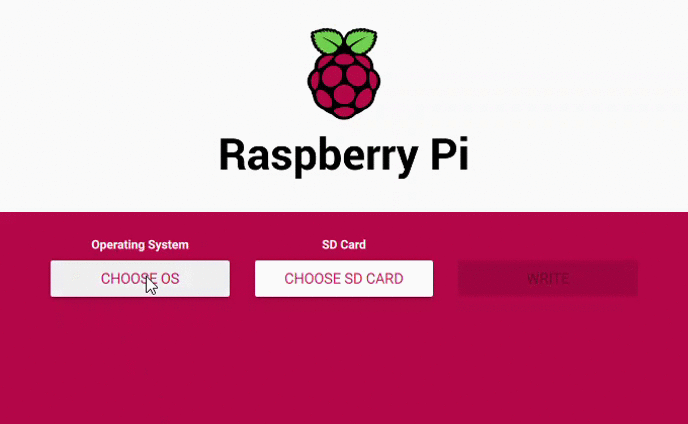

# IoT Home Environmental Alerting

Internet of Things (IoT) is an ever expanding field and one of the most common things to do is environmental alerting.  To do that, this tutorial uses the [Twilio Developer Kit for Broadband IoT](https://www.twilio.com/docs/iot/wireless/get-started-twilio-developer-kit-broadband-iot) to monitor for temperature, humidity, and liquid and sends an SMS alerting you to conditions that are outside your desired parameters. The developer kit allows you to be connected to the cellular network, allowing for monitoring at remote locations such as a cabin where internet access may not be readily available.  

If you are setting this up in a location where internet is available, data via a cellular network is not needed to complete setup.

## Requirements
To complete this tutorial you'll need the following
- [Twilio Developer Kit for Broadband IoT](https://www.twilio.com/docs/iot/wireless/get-started-twilio-developer-kit-broadband-iot) (Instructions on how to purchase are at this link)
- [Latest Raspberry Pi OS](https://www.raspberrypi.org/software/)
- python libraries
    - python venv 
    - pip3
    - [groove](https://github.com/Seeed-Studio/grove.py#installation)
    - [luma.core](https://pypi.org/project/luma.core/)
    - [luma.oled](https://pypi.org/project/luma.oled/)
    - [paho.mqtt](https://pypi.org/project/paho-mqtt/)
    - [adafruit-circuitpython-ads1x15](https://pypi.org/project/adafruit-circuitpython-ads1x15/)
    - [twilio](https://pypi.org/project/twilio/)

## Installing the latest Raspberry Pi OS
The Raspberry Pi Foundation has a Raspberry Pi Imager that can be used to get the latest Raspberry Pi OS and image it on the SD card.  You can dowload the imager [here](https://www.raspberrypi.org/software/).  Select the latest Raspberry Pi OS Lite (that has no desktop application).  We'll connect to it via SSH to do all of our work.  

## Enable SSH and connect to local Wi-Fi if available

We'll be connecting to our Raspberry Pi via SSH. We can enable SSH by adding a file to SD Card named `ssh` with no extension.  This file should be added to the boot partition of the SD card ([further instructions here](https://www.raspberrypi.org/documentation/remote-access/ssh/)).

## Setting up SIM Card

Twilio has a [guide](https://www.twilio.com/docs/iot/wireless/how-to-order-and-register-your-first-sim) for registering your SIM card and selecting a rate plan. We will only be using data to send sms messages as needed. 

## Twilio Developer Kit Setup
Twilio has a [Quick Start Guide](https://www.twilio.com/docs/iot/wireless/get-started-twilio-developer-kit-broadband-iot) that walks through how to setup and get going with the developer kit that is worth.  Follow the [hardware setup section](https://www.twilio.com/docs/iot/wireless/get-started-twilio-developer-kit-broadband-iot#the-hardware) and this guide will take it from there.

## Enabling SSH and setting permanent IP Address
In the broadband kit there's

