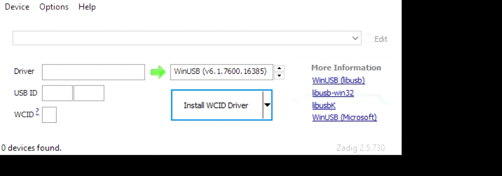

# Garmin FIT File Extract on Windows
I wanted to get my run and bike files off of my Garmin 910XT without having to upload them to Garmin Connect.  Thankfully I wasn't the first person that has wanted to do this and I found a library that would allow me to do that - [openant](https://github.com/Tigge/openant).

Generally I do my development work in [WSL](https://docs.microsoft.com/en-us/windows/wsl/about) but it [doesn't support USB devices](https://github.com/microsoft/WSL/issues/2195). There seems to be some [workarounds](https://github.com/rpasek/usbip-wsl2-instructions) but after looking at a couple of the other issues and pull requests on [openant](https://github.com/Tigge/openant) and related [antfs-cli](https://github.com/Tigge/antfs-cli) project it seems others had used openant with Windows the how wasn't documented anywhere.

This is a detailed explanation of how to get openant and by association antfs-cli to work with Windows. The [PR](https://github.com/Tigge/openant/pull/64) includes instructions as well.

## Requirements

[ANT-FS device](https://github.com/Tigge/openant#ant-fs-devices)
[ANT USB Stick](https://github.com/Tigge/openant#ant-fs-devices) - I used ANTUSB-m
[Zadig](http://zadig.akeo.ie/) - to install libusb driver for your ANT-USB stick
- python libraries
    - python venv 
    - pip3
    - [libusb](https://pypi.org/project/libusb/)
    - [pyusb](https://pypi.org/project/pyusb/)

We'll also be using a [forked version](https://github.com/persamina/openant/tree/windows) of openant library that works with Windows by bypassing the unnecessary parts (udev_rules) and adding a pause to allow for 

## Installing libusb driver for ANT-USB stick
We'll first install libusb driver for the ANT-USB stick plugged into your computer. Make sure its plugged in and follow the steps captured below.  We'll follow libusb's [recommended way](https://github.com/libusb/libusb/wiki/Windows#Driver_Installation) of installing the driver.

